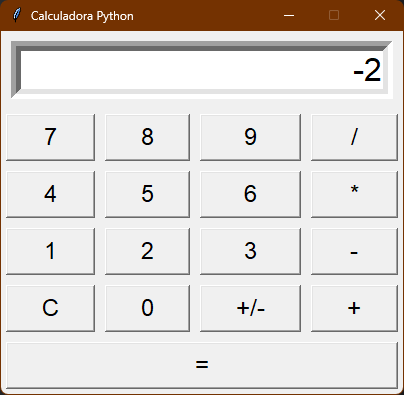

# 🧮 Calculadora com Interface Gráfica em Python


Uma aplicação de calculadora de desktop funcional, desenvolvida com Python e a biblioteca padrão Tkinter. Este projeto serviu como uma introdução prática à criação de Interfaces Gráficas de Usuário (GUI) e à programação orientada a eventos.

### Captura de Tela da Aplicação
---

## ✨ Funcionalidades

* **Operações Básicas:** Suporte completo para adição, subtração, multiplicação e divisão.
* **Cálculos em Cadeia:** Permite realizar operações sequenciais (como `5 * 2 + 3`) que são resolvidas automaticamente ao inserir o próximo operador, imitando o comportamento de uma calculadora padrão.
* **Inversão de Sinal (+/-):** Um botão dedicado para facilmente alternar o sinal do número atual no visor, permitindo o uso de números negativos nos cálculos.
* **Limpeza Total (C):** Um botão 'C' que reseta completamente o estado e o visor da calculadora.
* **Interface Intuitiva:** Layout em grade, responsivo e de fácil utilização, construído com Tkinter.
* **Tratamento de Erros:** Exibe uma mensagem de "Erro" no visor para operações inválidas, como divisão por zero.
---

## 🛠️ Conceitos e Tecnologias Aplicadas

* **Python 3**
* **Tkinter:** A biblioteca padrão do Python para criação de interfaces gráficas.
* **Gerenciamento de Layout com `.grid()`:** Organização dos widgets em uma grade para um layout complexo.
* **Programação Orientada a Eventos:** Utilização de `callbacks` (a opção `command`) para executar funções em resposta a cliques de botão.

---
### Captura de Tela da Aplicação


## 🚀 Como Executar

1.  **Clone o repositório:**
    ```bash
    git clone https://github.com/MatheusRuasVieira/calculadora_tkinter_python.git
    ```

2.  **Navegue até a pasta do projeto:**
    ```bash
    cd calculadora_tkinter_python
    ```

3.  **Execute o script:**
    ```bash
    python main.py
    ```
A janela da calculadora será aberta.

---

## 📄 Licença

Este projeto está sob a licença MIT. Veja o arquivo [LICENSE](LICENSE) para mais detalhes.